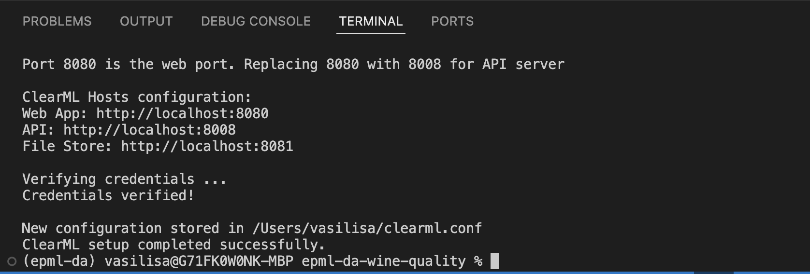
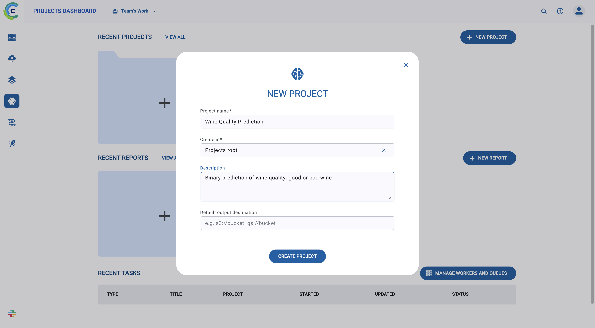
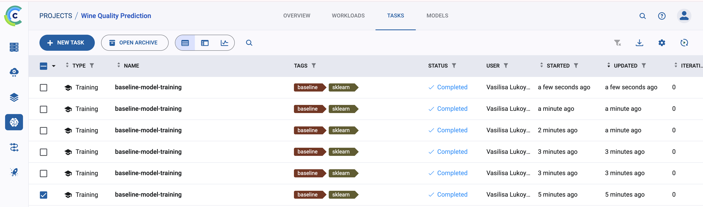
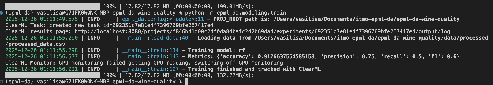
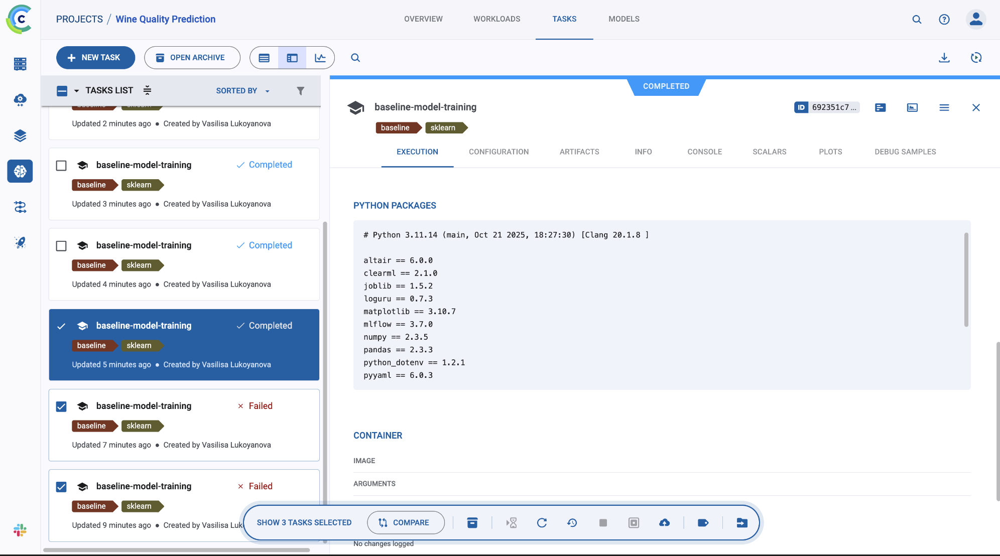
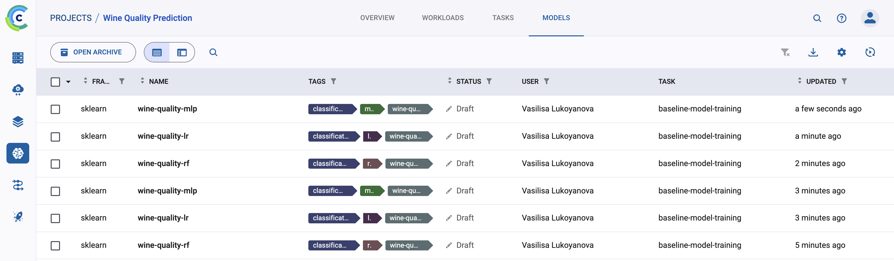
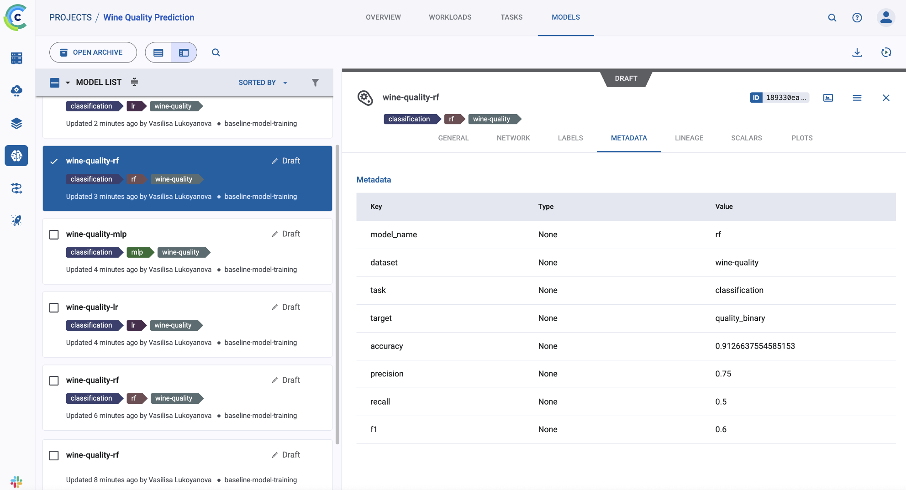
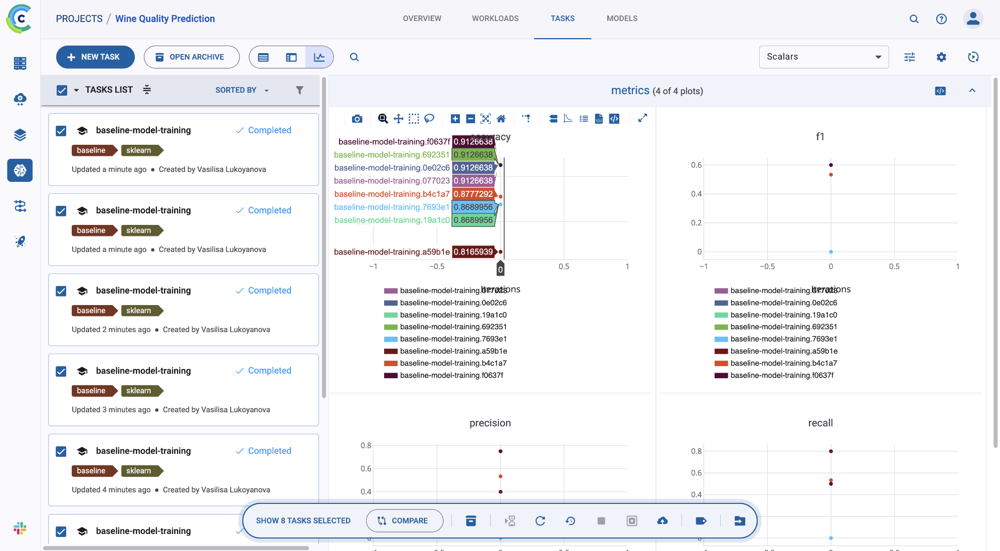
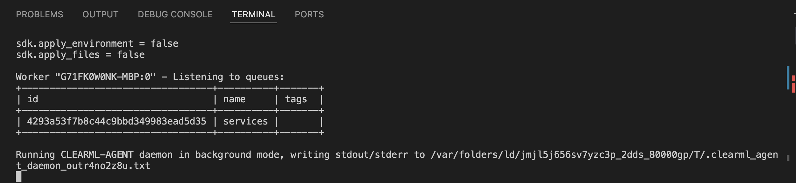
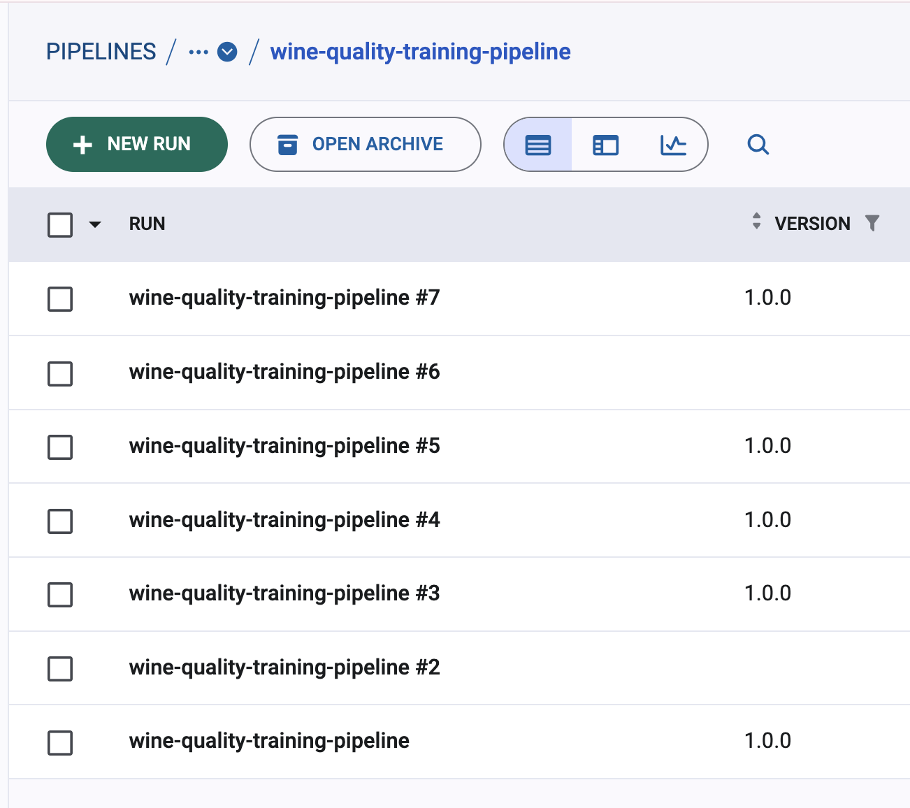

# Настройка ClearML
## Установка и настройка ClearML Server

В данном проекте ClearML устанавливается локально

Скрипт для установки:

```bash
# clearml_server_start.sh
#!/bin/bash

# Script to start ClearML Server locally using Docker Compose

set -e
SCRIPT_DIR="$(cd "$(dirname "${BASH_SOURCE[0]}")" && pwd)"

PROJECT_ROOT="$(cd "$SCRIPT_DIR/.." && pwd)"

cd "$PROJECT_ROOT"

echo "Starting ClearML Server..."

echo ""

# Check if Docker is running

if ! docker info > /dev/null 2>&1; then

echo "Error: Docker is not running. Please start Docker and try again."

exit 1

fi

# Check if docker-compose is available

if command -v docker-compose &> /dev/null; then

COMPOSE_CMD="docker-compose"

elif command -v docker &> /dev/null && docker compose version &> /dev/null; then

COMPOSE_CMD="docker compose"

else

echo "Error: docker-compose or 'docker compose' not found. Please install Docker Compose."

exit 1

fi

# Start the server

$COMPOSE_CMD -f docker-compose.clearml.yml up -d

echo ""

echo "ClearML Server is starting..."

echo ""

echo "Web UI will be available at: http://localhost:8080"

echo "API Server will be available at: http://localhost:8008"

echo ""

echo "To view logs, run:"

echo " $COMPOSE_CMD -f docker-compose.clearml.yml logs -f"

echo ""

echo "To stop the server, run:"

echo " $COMPOSE_CMD -f docker-compose.clearml.yml down"

echo ""

echo "Waiting for server to be ready..."

sleep 5

# Wait for server to be ready

MAX_WAIT=120

WAIT_TIME=0

while [ $WAIT_TIME -lt $MAX_WAIT ]; do

if curl -f http://localhost:8080 > /dev/null 2>&1; then

echo ""

echo "✓ ClearML Server is ready!"

echo ""

echo "Next steps:"

echo "1. Open http://localhost:8080 in your browser"

echo "2. Create an account (first user becomes admin)"

echo "3. Go to Settings -> Workspace -> Create new credentials"

echo "4. Run: clearml-init"

echo " Or set environment variables:"

echo " export CLEARML_API_HOST=http://localhost:8008"

echo " export CLEARML_API_ACCESS_KEY=your-access-key"

echo " export CLEARML_API_SECRET_KEY=your-secret-key"

exit 0

fi

sleep 2

WAIT_TIME=$((WAIT_TIME + 2))

echo -n "."

done


echo ""

echo "Warning: Server may still be starting. Check logs with:"

echo " $COMPOSE_CMD -f docker-compose.clearml.yml logs"

exit 0
```

Устанавливаем

```bash
bash scripts/clearml_server_start.sh
```

## Настройка базы данных и хранилища

ClearML Server автоматически настраивает:

- **MongoDB** для хранения метаданных экспериментов
- **Elasticsearch** для поиска и фильтрации
- **Redis** для кэширования
- **File Server** для хранения артефактов (модели, датасеты, логи)

Для локальной установки все компоненты запускаются в Docker контейнере.

Также устанавливаем python библиотеку clearml

```bash
poetry add clearml
```
## Настройка аутентификации

Открываем сервер ClearML в браузере http://localhost:8080
Первый пользователь автоматически становится админом, вводим все данные

Создаем новые credentials через Settings -> Workspace -> Create new credentials

Получаем access_key и secret_key

Адреса серверов:

web_server:http://localhost:8080

api_server:http://localhost:8008

files_server:http://localhost:8081

Копируем эти параметры, далее делаем clearml-init



Получаем конфиг

```
# clearml.conf
api {
    web_server: http://localhost:8080
    api_server: http://localhost:8008
    files_server: http://localhost:8081
    credentials {
        "access_key" = "YOUR_ACCESS_KEY"
        "secret_key" = "YOUR_SECRET_KEY"
    }
}
```

## Создание проекта и экспериментов

Создан проект Wine Quality Prediction.



Все эксперименты автоматически логируются в этот проект.



Это реализовано в modeling/train.py

## Управление моделями
Регистрация и версионирование моделей, метаданные для моделей, автоматическое создание версий были настроены с помощью библиотеки clearml, через Task, OutputModel.








## Пайплайн

Создан и настроен пайплайн обучения modeling/clearml_pipeline.py

Запускается через ClearML Agent

```
poetry add clearml-agent
clearml-agent daemon --queue services
```

В пайплайне указали нужную очередь

```
    pipe.set_default_execution_queue("services")
```


