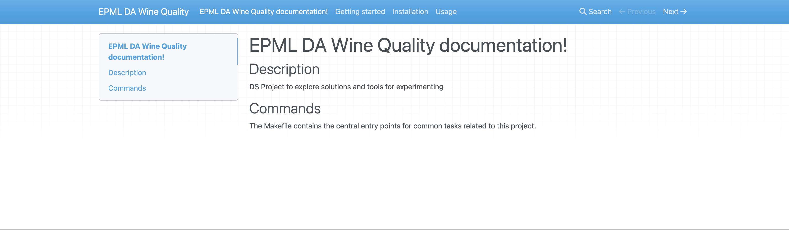
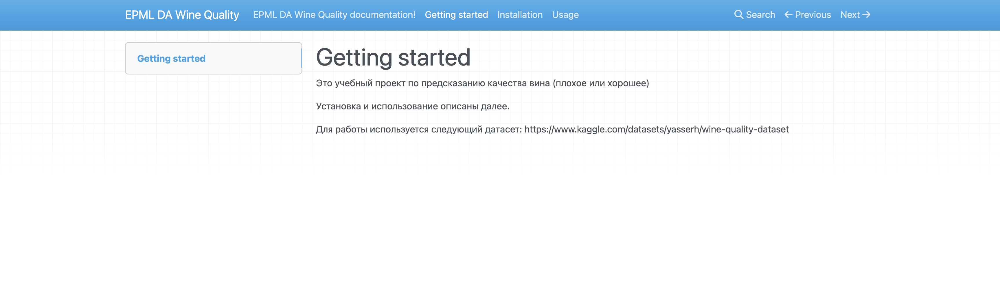
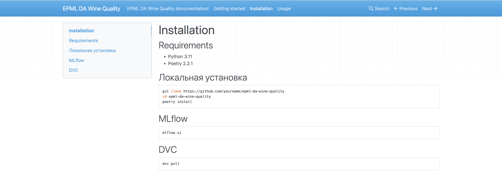
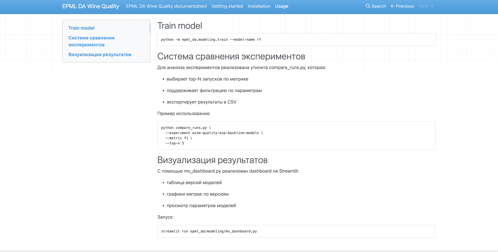
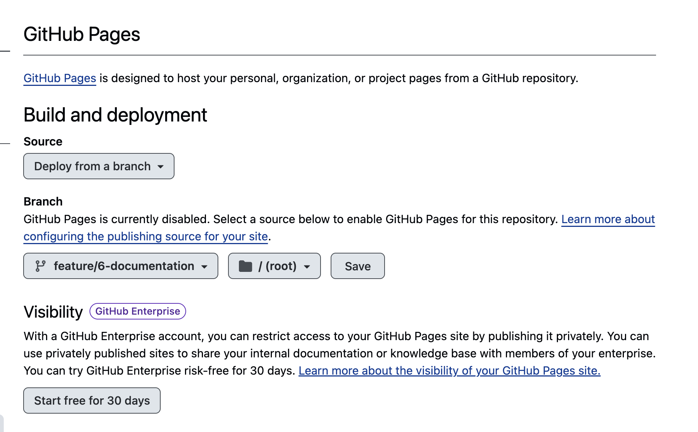
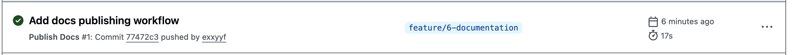

## Техническая документация

Устанавливаем mkdocks

```
poetry add --group docs mkdocs mkdocs-material
```

Создаем структуру документации. По идее, она уже есть из CCDS шаблона.

```
mkdocs new docs
```

```
poetry run mkdocs serve

```

В нее добавлены инструкция по установке, информация о проекте, примеры использования

Документация открывается по адресу http://127.0.0.1:8000/








## Автоматическая публикация

Создаем файл .github/workflows/docs.yml

С помощью github actions документация на github pages должна обновляться, подтягивая изменения

https://exxyyf.github.io/epml-da-wine-quality/


